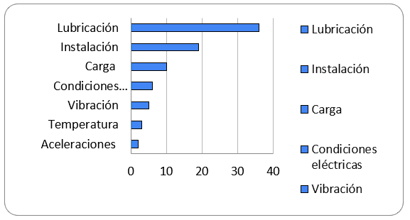
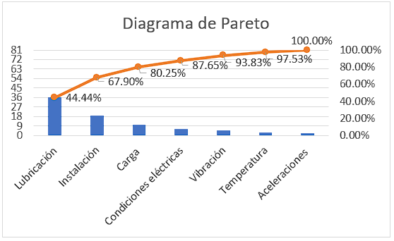

# ANÁLISIS DE FALLAS DE COMPONENTES EN EQUIPO PESADO MÓVIL

## TEMA: BEARING DOCTOR NSK

### INTEGRANTES
* ABANTO PACHECO, GUVER THANER
* BENIQUE LÓPEZ, DAVID JONATHAN
* HUERTOS OCHOA, CRISTHIAN JUSÚS ALEXANDER
* OTAZU ESQUIVEL, JOSÉ LUIS
* VILLASANTE CUMPA, ROMINA

### DOCENTE
* MORALES SEGURA, LUIS HIALMAR

### LIMA - AREQUIPA - 2022

1. INTRODUCCION: 

Cuando un rodamiento se danifica durante la operación, la máquina o equipo puede trabarse o presentar una mal operación por completo. De fallas prematuras de rodamientos o problemas inesperados, es importante ser capaz de identificar o prever la falla, para que se tomen las medidas preventivas. Generalmente, la inspección del rodamiento puede identificar las causas del problema. Frecuentemente, se atribuyen las causas a las fallas de lubricación, manejo inadecuado, selección errada del rodamiento, o descuido durante el proyecto del eje o alojamiento. Normalmente se puede determinar la causa cuando se considera las condiciones de operación del rodamiento antes de la falla, investigándose las condiciones de lubricación y instalación y aún, cuando se investiga cuidadosamente la parte danificada. Algunas veces los rodamientos se danifican o fallan rápida e inesperadamente. Una vez que la falla prematura es diferente de la falla por fatiga que ocurre por descamación, podemos separar la vida de los rodamientos en dos grupos: fallas prematuras y fallas normales por la fatiga del acero.

2. OBJETIVOS
* Identificar los síntomas y causas de daños en rodamientos.
* Evaluar las causas e identificar las más relevantes.
* Interpretación del diagrama Pareto con los datos obtenidos.

3.  RECURSOS & HERRAMIENTAS
* Documento Bearing Doctor NSK – Diagnóstico rápido de fallas en rodamientos 
* Software Microsoft Excel
* Colaboratory Google

4.  DESARROLLO
    1. Solución con el software de Microsoft Excel:

        1. Identificación de las posibles causas de daños en los rodamientos de acuerdo con el documento Bearing Doctor NSK ([Tabla 1.0](#anexo1)) .

        2. Conteo de las causas mediante el software Microsoft Excel, obteniendo los valores de frecuencias relativas mostrados en la tabla  ([Tabla 1.1](#anexo2)) .

        3. Obtenemos un gráfico de barras, para una mayor compresión de las causas más relevantes que producen daños a los rodamiento ([Imagen 1.0](#anexo4)) .

        4. Realizamos un cuadro de frecuencias relativas acumuladas ([Tabla 1.2](#anexo3))  para identificar, de acuerdo a Pareto, cuáles son nuestras causas que impactan más al daño de rodamientos, valiéndose al principio de la regla 80/20.

        5. Con los datos obtenidos anteriormente, obtenemos nuestro diagrama de Pareto ([Imagen 1.1](#anexo5)) .

    2. Solución con el software Colaboratory de Google:
        1. Link del archivo editable: [Colab Google](https://colab.research.google.com/drive/1Ul8S_w9P0jXl4GR_hopKUdUbMTHdk5RV?usp=sharing)
        2. Link del repositorio en Github: [Github Repository](https://github.com/mizhac/failure_analysis/blob/master/Task1/soluciones/analisis_causa_raiz.ipynb)
5. Conclusiones
    * Se logró identificar los síntomas y causas de daños en rodamientos a través de la documentación provista por el fabricante. Esta nos permitió agrupar los eventos de falla en base a causas comunes determinadas por el fabricante.
    * Se realizó el análisis de los datos en base a agrupaciones determinadas por causas comunes de fallas en rodamientos. Estas nos permitieron aplicar un análisis matemático que se determina por el monitoreo de frecuencias absolutas, relativas y acumuladas.
    * Se logró realizar y obtener resultados equitativos al generar los diagramas de Pareto utilizando dos herramientas tecnológicas diferentes. La primera herramienta para utilizar fue Excel de Microsoft que nos permitió realizar el flujo a través de la introducción de datos en las tablas y la generación de tablas dinámicas. La segunda herramienta a utilizar fe Colaboratory de Google que nos permitió realizar análisis de los datos a través del parseo de los datos en memoria y la utilización de fórmulas matemáticas.
    * Se determinaron que las causas más frecuentes de los eventos de falla en rodamiento son por 3 causas: Lubricación, Instalación y Carga cuyos valores representan el 80% del total de incidencias.

6. Bibliografía

* Google. (2021). Welcome to Colab. 05/20/2022, de Google Cloud Sitio web: [Link](https://colab.research.google.com/notebooks/welcome.ipynb?hl=es)
* NSK. (2004). Diagnóstico Rápido de Fallas en Rodamientos. 05/20/2022, de NSK Automation Sitio web: [Link](https://github.com/mizhac/failure_analysis/blob/master/Task1/documentos/nsk_bearing_doctor.pdf)

7. Anexos

*   Tabla 1.0 - Agrupación por SÍNTOMA/CAUSA

| **COMPONENTE** | **SÍNTOMA**                                    | **CAUSA RESUMEN**      | **CAUSA COMPLETA**                                         |
|----------------|------------------------------------------------|------------------------|------------------------------------------------------------|
| 7.3.1          | Rayadura                                       | Aceleraciones          | Aceleraciones irregulares                                  |
| 7.3.2          | Rayadura                                       | Aceleraciones          | Aceleraciones irregulares                                  |
| 7.1.7          | Descamación                                    | Carga                  | Carga Axial                                                |
| 7.1.8          | Descamación                                    | Carga                  | Carga Axial                                                |
| 7.10.3         | Deterioro                                      | Carga                  | Carga Excesiva                                             |
| 7.10.4         | Deterioro                                      | Carga                  | Carga Excesiva                                             |
| 7.13.1         | Deslizamiento y excoriaciones                  | Carga                  | Interferencia insuficiente                                 |
| 7.3.3          | Rayadura                                       | Carga                  | Rompimiento de lubricante por exceso de carga              |
| 7.5.3          | Fractura en la pestaña                         | Carga                  | Cargas repetitivas                                         |
| 7.5.4          | Fractura en la pestaña del anillo externo      | Carga                  | Carga despareja                                            |
| 7.6.3          | Rajaduras                                      | Carga                  | Carga de choque                                            |
| 7.7.4          | Jaula dañada                                   | Carga                  | Fractura                                                   |
| 7.15.1         | Deterioro                                      | Condiciones eléctricas | Diferencia de potencial                                    |
| 7.15.2         | Deterioro                                      | Condiciones eléctricas | Diferencia de potencial                                    |
| 7.15.3         | Pitting                                        | Condiciones eléctricas | Diferencia de potencial                                    |
| 7.15.4         | Color oscuro                                 | Condiciones eléctricas | Diferencia de potencial                                    |
| 7.15.5         | Derretimiento                                  | Condiciones eléctricas | Utilización de máquina de soldar                           |
| 7.15.6         | Derretimiento                                  | Condiciones eléctricas | Utilización de máquina de soldar                           |
| 7.1.2          | Descamación                                    | Instalación            | Desaliniamiento                                            |
| 7.1.3          | Descamación en intervalo de bolas              | Instalación            | Impactos                                                   |
| 7.1.4          | Descamación en la pista                        | Instalación            | Impactos                                                   |
| 7.1.5          | Descamación                                    | Instalación            | Impactos                                                   |
| 7.1.6          | Descamación                                    | Instalación            | Impactos                                                   |
| 7.1.10         | Descamación                                    | Instalación            | Instalación                                                |
| 7.11.2         | Corrosión                                      | Instalación            | Ajuste inadecuado                                          |
| 7.13.2         | Marcas                                         | Instalación            | Juego entre el anillo y el alojamiento                     |
| 7.14.3         | Alteración de color                            | Instalación            | Precarga excesiva                                          |
| 7.14.4         | Alteración de color                            | Instalación            | Precarga excesiva                                          |
| 7.14.5         | Jaula derretida                                | Instalación            | Precarga excesiva                                          |
| 7.17.1         | Rayadura                                       | Instalación            | Inclinacion de los anillos                                 |
| 7.17.2         | Rayadura                                       | Instalación            | Inclinacion de los anillos                                 |
| 7.17.3         | Rayadura                                       | Instalación            | Inclinacion de los anillos                                 |
| 7.5.1          | Astillas en la pestaña del centro.             | Instalación            | Carga excesiva durante la instalación                      |
| 7.5.2          | Fractura en la pestaña                         | Instalación            | Carga de choque durante la instalación                     |
| 7.7.2          | Jaula dañada                                   | Instalación            | Acción de carga                                            |
| 7.7.5          | Jaula dañada                                   | Instalación            | Choque                                                     |
| 7.7.6          | Jaula dañada                                   | Instalación            | Choque                                                     |
| 7.1.1          | Descamación                                    | Lubricación            | Lubricación                                                |
| 7.1.9          | Descamación                                    | Lubricación            | Lubricación                                                |
| 7.10.1         | Puntos y deterioro                             | Lubricación            | Corrosión eléctrica                                        |
| 7.10.2         | Deterioro                                      | Lubricación            | Contaminación y vibración                                  |
| 7.11.3         | Corrosión                                      | Lubricación            | Contaminación                                              |
| 7.14.1         | Pista con alteración                           | Lubricación            | Lubricación                                                |
| 7.14.2         | Rodillos con alteración                        | Lubricación            | Lubricación                                                |
| 7.16.1         | Oxidación                                      | Lubricación            | Lubricación                                                |
| 7.16.2         | Oxidación                                      | Lubricación            | Formacion de particulas de agua por condensacion           |
| 7.16.3         | Oxidación                                      | Lubricación            | Entrada de agua                                            |
| 7.16.4         | Corrosión                                      | Lubricación            | Formacion de particulas de agua por condensacion           |
| 7.18.1         | Coloración                                     | Lubricación            | Lubricación                                                |
| 7.18.2         | Coloración                                     | Lubricación            | Lubricación                                                |
| 7.2.1          | Desgaste o descascarado                        | Lubricación            | Lubricación                                                |
| 7.2.3          | Desgaste o descascarado                        | Lubricación            | Lubricación                                                |
| 7.2.4          | Desgaste o descascarado                        | Lubricación            | Lubricación                                                |
| 7.3.4          | Rayadura                                       | Lubricación            | Lubricación                                                |
| 7.3.5          | Rayadura                                       | Lubricación            | Contaminacion por exceso de carga                          |
| 7.3.6          | Rayadura                                       | Lubricación            | Contaminacion por exceso de carga                          |
| 7.3.7          | Rayadura                                       | Lubricación            | Ingreso de particular                                      |
| 7.4.1          | Patinaje                                       | Lubricación            | Exceso de grasa                                            |
| 7.4.2          | Patinaje                                       | Lubricación            | Exceso de grasa                                            |
| 7.4.3          | Patinaje                                       | Lubricación            | Lubricación                                                |
| 7.4.4          | Patinaje                                       | Lubricación            | Lubricación                                                |
| 7.4.5          | Patinaje                                       | Lubricación            | Lubricación                                                |
| 7.4.6          | Patinaje                                       | Lubricación            | Lubricación                                                |
| 7.4.7          | Patinaje                                       | Lubricación            | Lubricación                                                |
| 7.6.2          | Grietas térmicas en la cara de los rodillos    | Lubricación            | Deficiencia de lubricación                                 |
| 7.7.3          | Jaula dañada                                   | Lubricación            | Fractura                                                   |
| 7.7.7          | Jaula dañada                                   | Lubricación            | Deterioro                                                  |
| 7.8.1          | Abolladura                                     | Lubricación            | Contaminación por impurezas                                |
| 7.8.2          | Impresiones en pista                           | Lubricación            | Contaminación por impurezas                                |
| 7.8.3          | Abolladura                                     | Lubricación            | Contaminación por impurezas                                |
| 7.8.4          | Abolladura                                     | Lubricación            | Contaminación por impurezas                                |
| 7.9.1          | Pitting                                        | Lubricación            | Oxidación                                                  |
| 7.9.2          | Pitting                                        | Lubricación            | Oxidación                                                  |
| 7.6.1          | Grietas térmicas en la cara del aro externo    | Temperatura            | Generación de calor anormal                                |
| 7.6.4          | Rajaduras en la superficie externa             | Temperatura            | Rotación del anillo externo                                |
| 7.6.6          | Rajaduras axiales en la superficie de la pista | Temperatura            | Diferencia de temperatura entre el anillo interno y el eje |
| 7.11.1         | Corrosión                                      | Vibración              | Vibración y mal ajuste                                     |
| 7.12.1         | Desgaste                                       | Vibración              | Vibraciones de origen                                      |
| 7.12.2         | Desgaste                                       | Vibración              | Vibraciones de origen                                      |
| 7.12.3         | Desgaste                                       | Vibración              | Vibración continua                                         |
| 7.12.4         | Desgaste                                       | Vibración              | Vibraciones de origen                                      |

*  Tabla 1.1 - Frecuencias Relativas

| **CAUSA**              | **FRECUENCIA** |
|------------------------|----------------|
| Lubricación            | 36             |
| Instalación            | 19             |
| Carga                  | 10             |
| Condiciones eléctricas | 6              |
| Vibración              | 5              |
| Temperatura            | 3              |
| Aceleraciones          | 2              |
| Total General          | 81             |

*  Tabla 1.2 - Frecuencias Relativas Acumuladas

| **Causa**              | **Frecuencia Acumulada** | **Frecuencia Relativa** | **Frecuuencia Relativa Acumulada** |
|------------------------|--------------------------|-------------------------|------------------------------------|
| Lubricación            | 36                       | 44,44%                | 44,44%                           |
| Instalación            | 19                       | 23,46%                | 67,90%                           |
| Carga                  | 10                       | 12,35%                | 80,25%                           |
| Condiciones eléctricas | 6                        | 7,41%                 | 87,65%                           |
| Vibración              | 5                        | 6,17%                 | 93,83%                           |
| Temperatura            | 3                        | 3,70%                 | 97,53%                           |
| Aceleraciones          | 2                        | 2,47%                 | 100,00%                          |

*  Imagen 1.0

*  Imagen 1.1 

